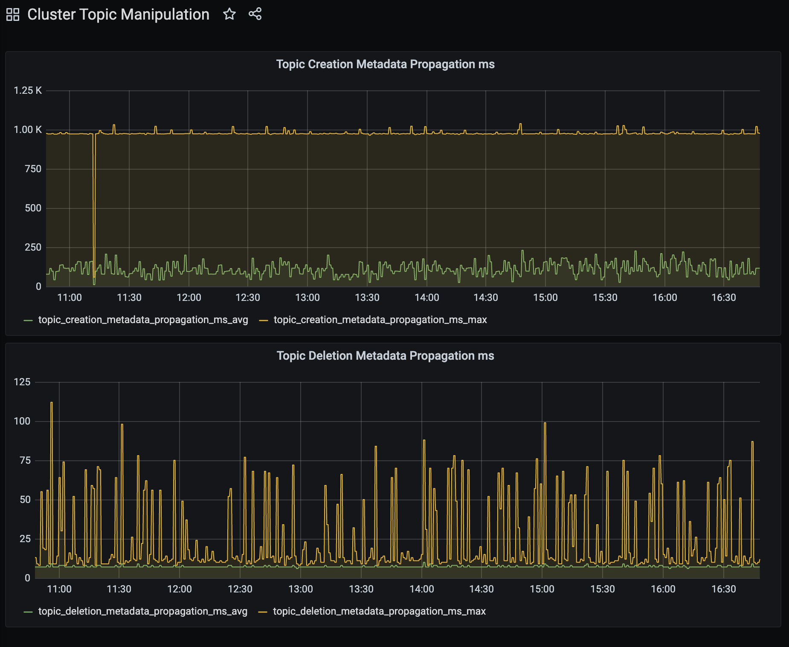
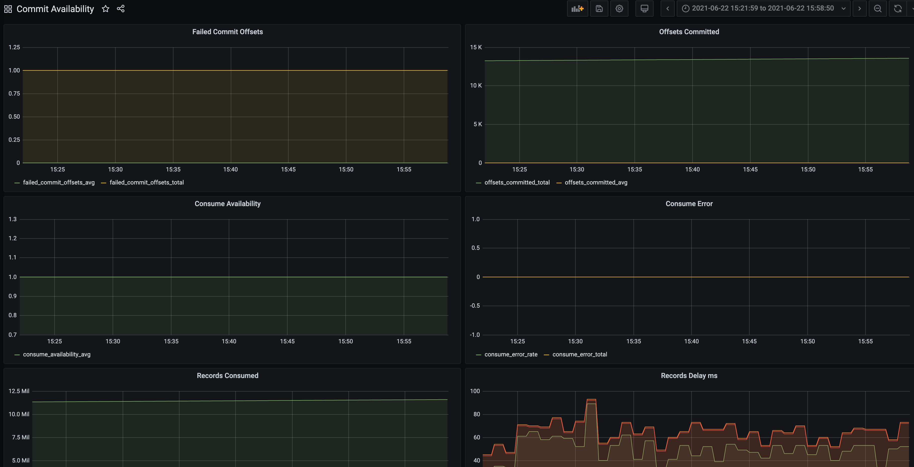
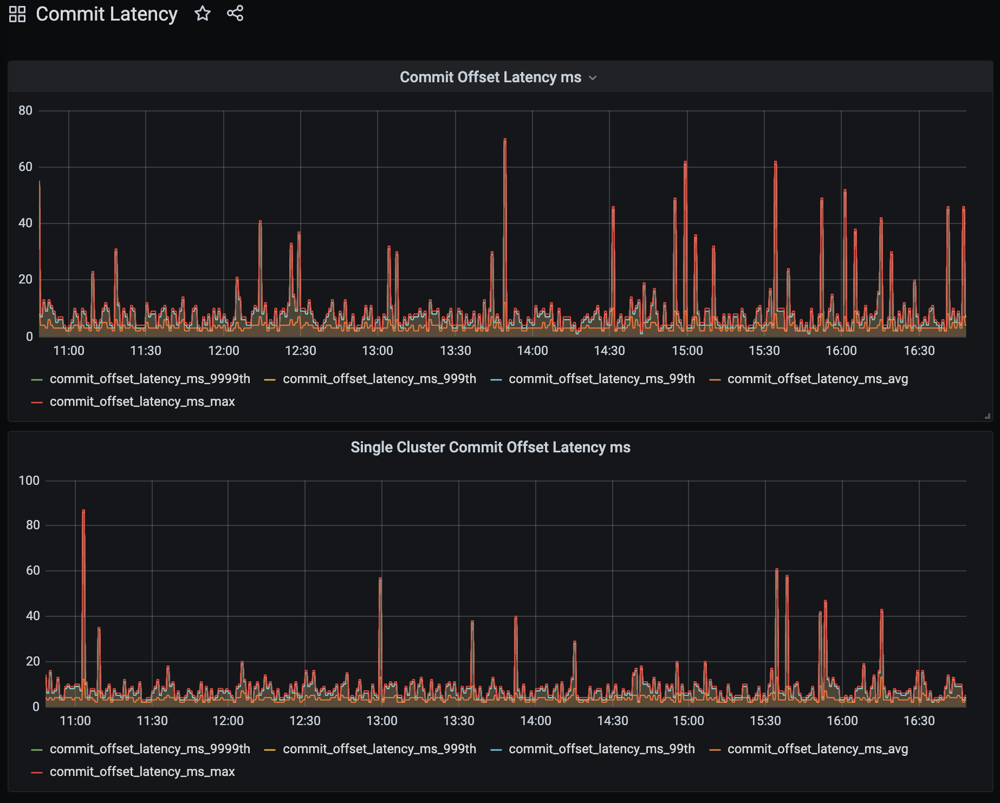
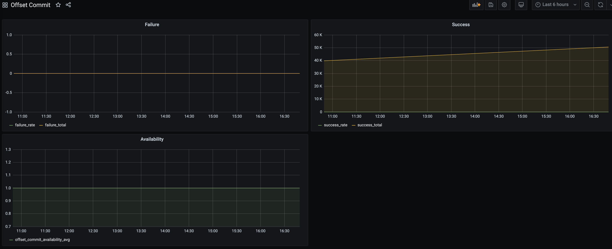
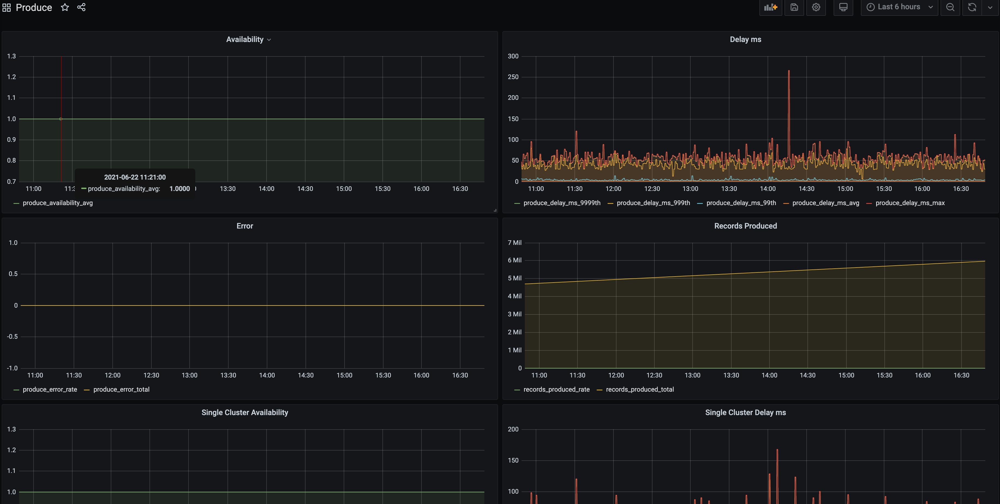

# [Kafka-Monitor] Boshrelease

While searching for better tools to monitor our kafka clusters we discovered [Kafka-Monitor] from LinkedIn. We created this simple boshrelease which should work out of the box provided the dependent releases are provided (check [manifest](manifests/kafkamonitor-withkafka.yml)). The manifest will deploy this release with a kafka cluster.

## Requirements

### Releases

- bpm
- kafka
- kafka-monitor
- zookeeper

## Usage

### Builtin dashboard

We exposed the static dashboard coming with the [Kafka-Monitor] under port 9000. The [jolokia] service is exposed at port 8778. In order to see the graphs provided both of the ports need to be exposed.

## Available metrics

While writing this bosh release we found out the we had to identify first all the provided metrics. Unfortunately the provided code was the only source.

On the version of [Kafka-Monitor] used (2.5.0) by this boshrelease the metrics found are described in [this json file](docs/metrics.json).

## Screenshots from Grafana dashboards

[Kafka-Monitor]: https://github.com/linkedin/kafka-monitor
[jolokia]: https://jolokia.org/